# AWS Cloud Networking — Complete Architecture

A single HTTP request touching every component we built across Labs 1-5.

---

## The Full Stack

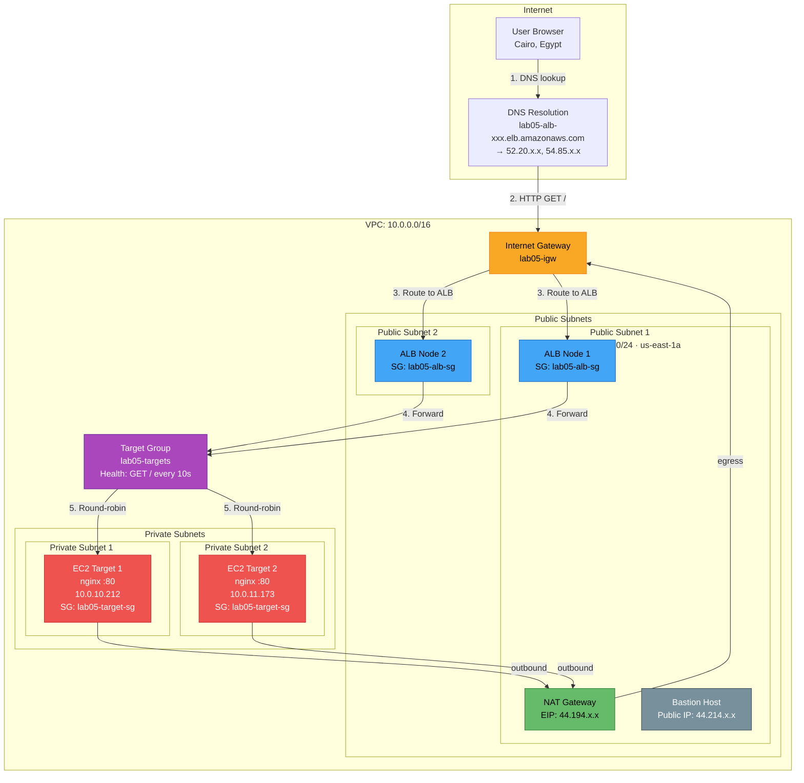

---

## Component Inventory

```mermaid
graph LR
    subgraph "Lab 1: Foundation"
        VPC[VPC<br/>IP range + router]
        SUB[Subnets<br/>AZ-pinned slices]
        RT_LOCAL[Route: local<br/>intra-VPC traffic]
    end

    subgraph "Lab 2: Internet Access"
        IGW2[Internet Gateway<br/>VPC ↔ Internet bridge]
        RT_IGW[Route: 0.0.0.0/0 → IGW]
        PUB_IP[Public IP<br/>IGW NAT: private ↔ public]
    end

    subgraph "Lab 3: Private Egress"
        NAT2[NAT Gateway<br/>One-way valve]
        EIP[Elastic IP<br/>Stable public addr for NAT]
        RT_NAT[Route: 0.0.0.0/0 → NAT]
    end

    subgraph "Lab 4: Firewalls"
        SG[Security Group<br/>Stateful, allow-only]
        NACL[NACL<br/>Stateless, allow+deny]
    end

    subgraph "Lab 5: Load Balancing"
        ALB[ALB<br/>HTTP distribution]
        TG2[Target Group<br/>Health-checked pool]
        LISTENER[Listener<br/>Port 80 → forward]
    end

    VPC --> SUB --> RT_LOCAL
    RT_LOCAL --> IGW2 --> RT_IGW --> PUB_IP
    PUB_IP --> NAT2 --> EIP --> RT_NAT
    RT_NAT --> SG --> NACL
    NACL --> ALB --> LISTENER --> TG2

    style VPC fill:#e3f2fd,stroke:#1565c0
    style IGW2 fill:#fff3e0,stroke:#e65100
    style NAT2 fill:#e8f5e9,stroke:#2e7d32
    style SG fill:#fce4ec,stroke:#c62828
    style ALB fill:#e8eaf6,stroke:#283593
```

---

## A Single HTTP Request — Step by Step

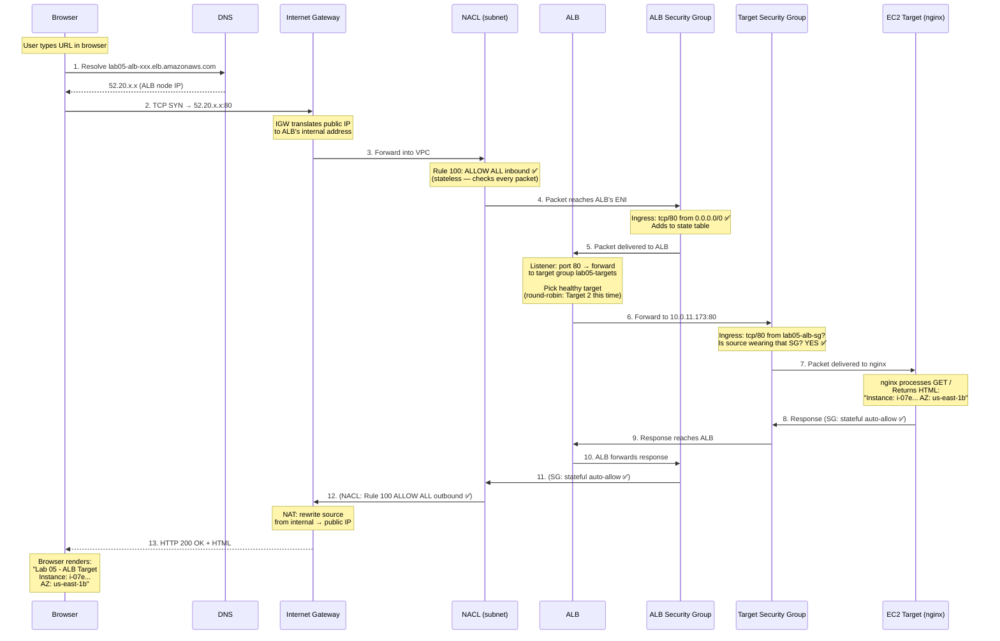

---

## Route Tables — The Decision Engine

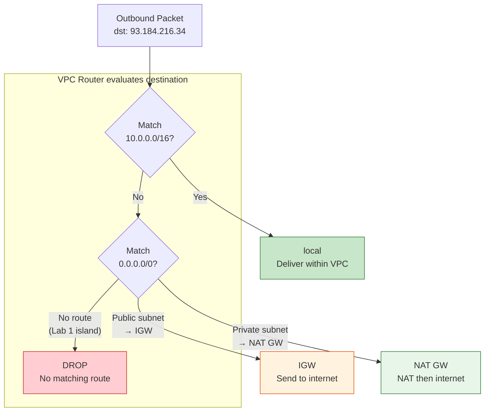

### Three subnet personalities from the same VPC

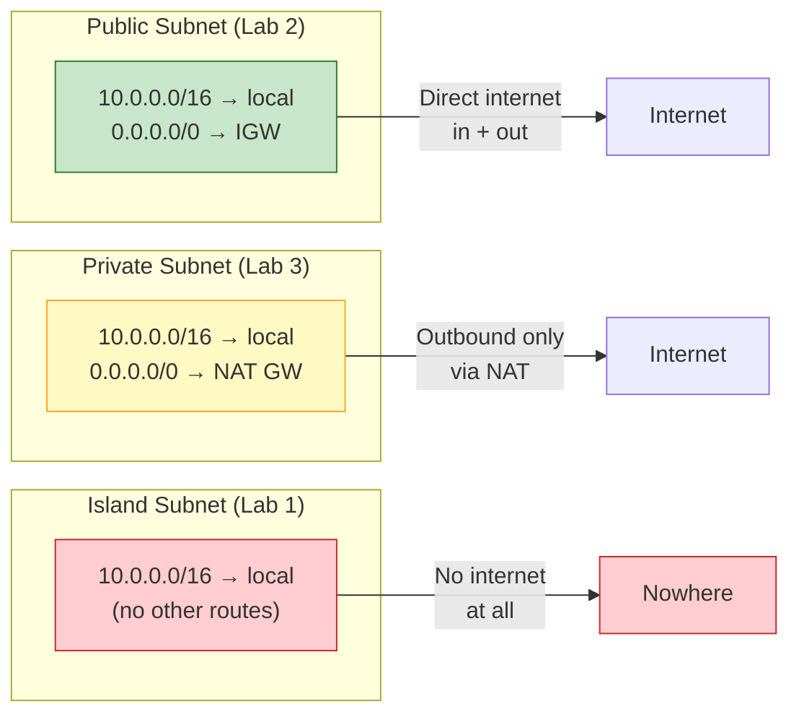

---

## Security Layers — Packet Gauntlet

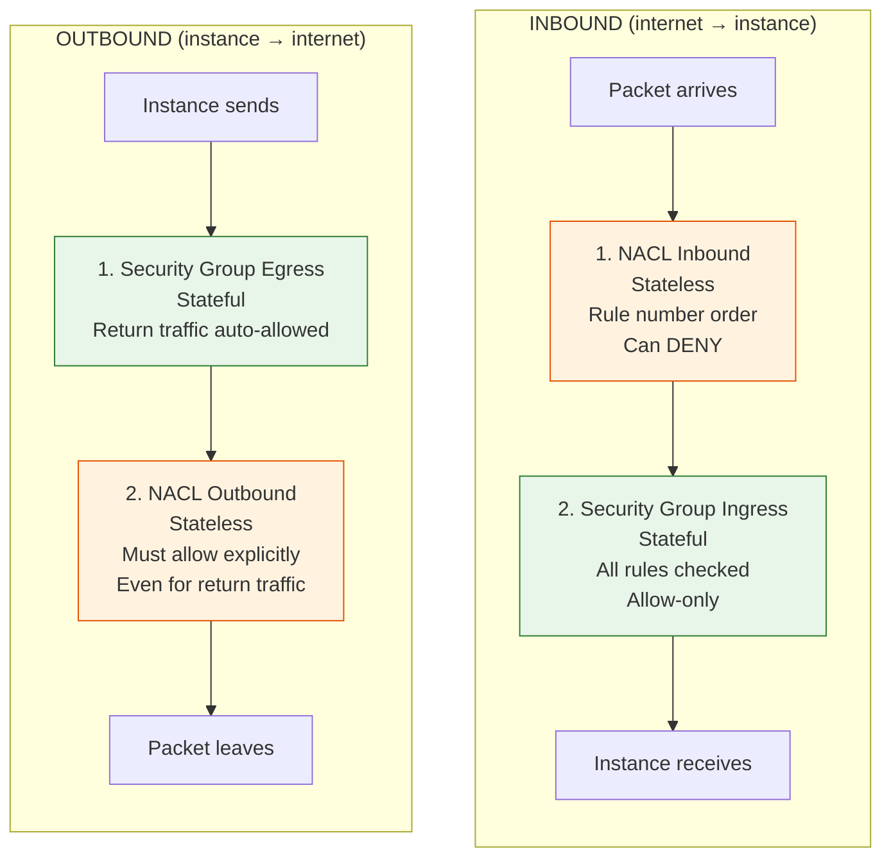

### What we proved empirically

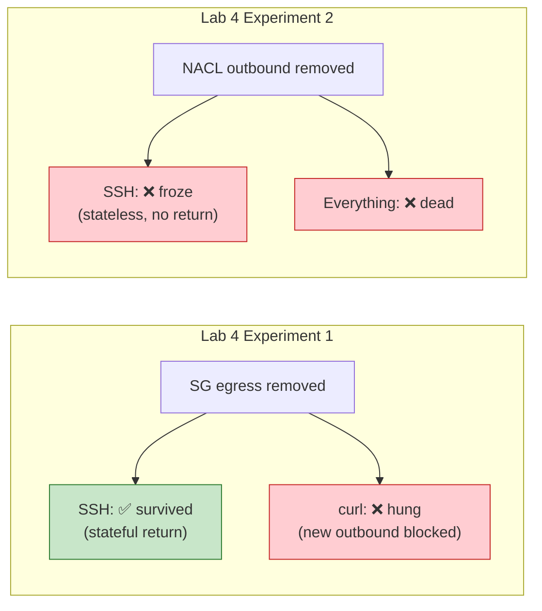

---

## NAT Chain — Private Instance Reaching Internet

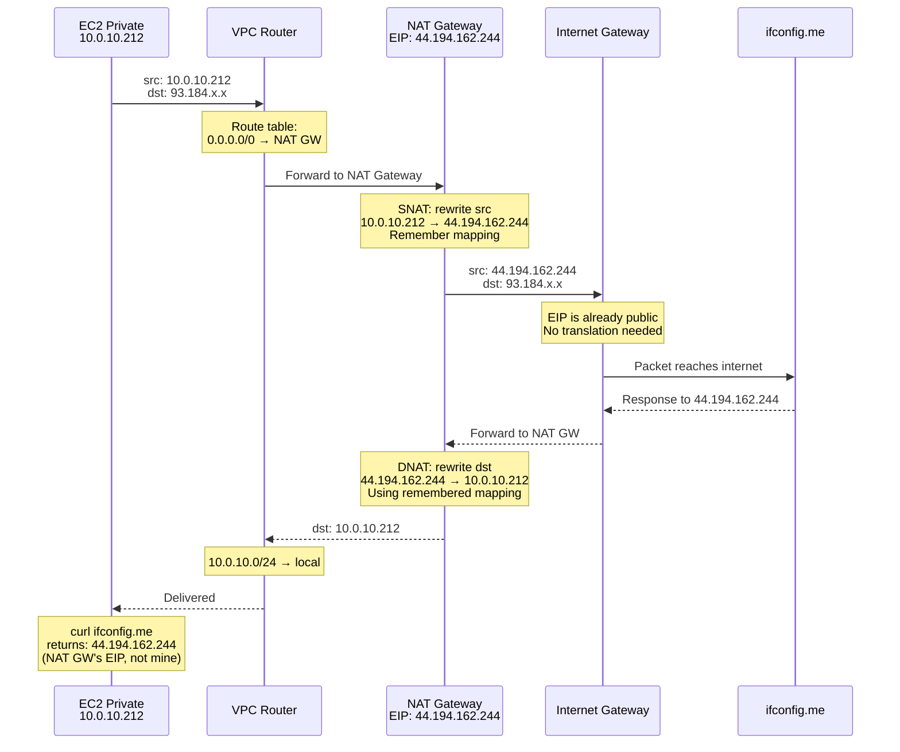

---

## ALB Health Check & Failover

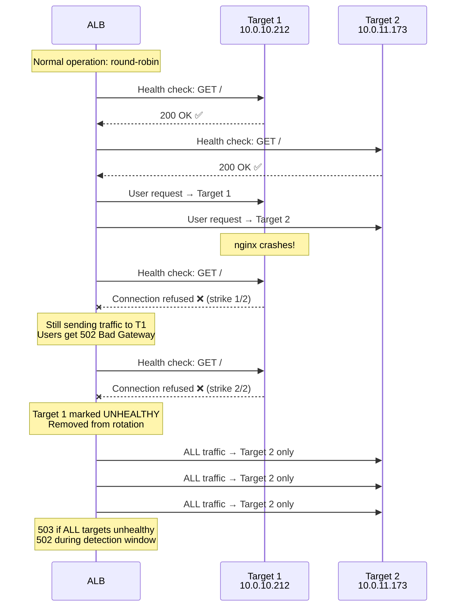

---

## SG-to-SG References — Identity-Based Security

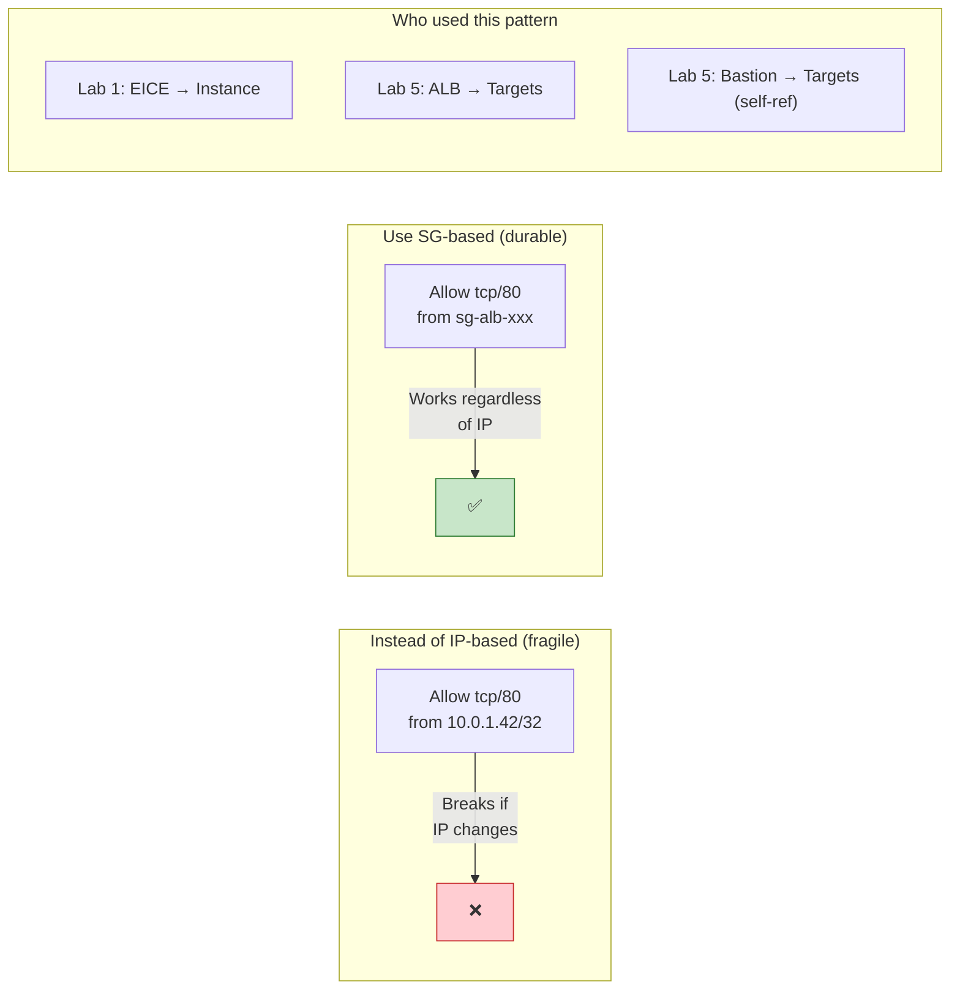

---

## Evolution Across Labs

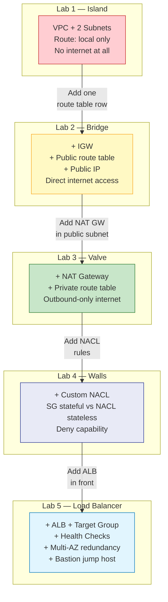

---

## Quick Reference — What Lives Where

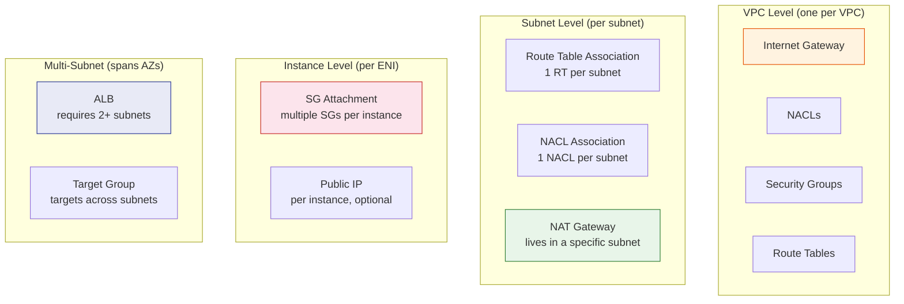

---

## The One Rule That Explains Everything

Every networking behavior we observed comes down to the **route table**:

| Route Table Entry | What It Enables | Lab |
|---|---|---|
| `10.0.0.0/16 → local` | Intra-VPC traffic (always present) | Lab 1 |
| `0.0.0.0/0 → igw-xxx` | Direct internet (public subnet) | Lab 2 |
| `0.0.0.0/0 → nat-xxx` | NAT'd internet (private subnet) | Lab 3 |
| (no 0.0.0.0/0 route) | No internet at all (island) | Lab 1 |

Routes decide **where packets go**. SGs/NACLs decide **if packets are allowed**. Both must say yes.

```
Connectivity = Route (path exists) + Permission (SG/NACL allow) + Reachability (target alive)
```
