# Terraform Components — Complete Reference

Every Terraform resource used across Labs 1-5, how they connect, what they need, and what they produce.

---

## Master Dependency Graph

```mermaid
graph TB
    %% Data sources
    AZS["data.aws_availability_zones<br/>─────────────────────<br/>Outputs: names[]<br/>'us-east-1a', 'us-east-1b'"]
    AMI["data.aws_ami<br/>─────────────────────<br/>Filter: al2023-ami-*-x86_64<br/>Outputs: id"]
    MYIP["data.http (checkip)<br/>─────────────────────<br/>Outputs: response_body<br/>'156.206.107.137'"]

    %% VPC
    VPC["aws_vpc<br/>─────────────────────<br/>Input: cidr_block = 10.0.0.0/16<br/>Output: id, cidr_block<br/>Creates: implicit main RT"]

    %% Subnets
    SUB_PUB["aws_subnet (public)<br/>─────────────────────<br/>Input: vpc_id, cidr_block, az<br/>Output: id, cidr_block, az"]
    SUB_PRIV["aws_subnet (private)<br/>─────────────────────<br/>Input: vpc_id, cidr_block, az<br/>Output: id, cidr_block, az"]

    %% Gateways
    IGW["aws_internet_gateway<br/>─────────────────────<br/>Input: vpc_id<br/>Output: id"]
    EIP["aws_eip<br/>─────────────────────<br/>Input: domain = vpc<br/>Output: id, public_ip"]
    NAT["aws_nat_gateway<br/>─────────────────────<br/>Input: allocation_id, subnet_id<br/>Output: id"]

    %% Route tables
    RT_PUB["aws_route_table (public)<br/>─────────────────────<br/>Input: vpc_id<br/>Route: 0.0.0.0/0 → igw<br/>Output: id"]
    RT_PRIV["aws_route_table (private)<br/>─────────────────────<br/>Input: vpc_id<br/>Route: 0.0.0.0/0 → nat<br/>Output: id"]
    RTA_PUB["aws_route_table_association<br/>(public subnets)"]
    RTA_PRIV["aws_route_table_association<br/>(private subnets)"]

    %% Security groups
    SG_ALB["aws_security_group (ALB)<br/>─────────────────────<br/>Input: vpc_id<br/>Output: id"]
    SG_TGT["aws_security_group (target)<br/>─────────────────────<br/>Input: vpc_id<br/>Output: id"]
    SG_RULE_1["ingress: tcp/80<br/>from 0.0.0.0/0"]
    SG_RULE_2["ingress: tcp/80<br/>from sg-alb (SG ref)"]
    SG_RULE_3["ingress: tcp/22<br/>from operator IP"]
    SG_RULE_4["egress: all<br/>to 0.0.0.0/0"]

    %% NACL
    NACL["aws_network_acl<br/>─────────────────────<br/>Input: vpc_id, subnet_ids<br/>Output: id"]
    NACL_RULE["aws_network_acl_rule<br/>─────────────────────<br/>Input: nacl_id, rule_number,<br/>rule_action, protocol, cidr"]

    %% Key pair
    KEY["aws_key_pair<br/>─────────────────────<br/>Input: public_key (file)<br/>Output: key_name"]

    %% EC2
    EC2["aws_instance<br/>─────────────────────<br/>Input: ami, instance_type,<br/>subnet_id, sg_ids, key_name,<br/>user_data<br/>Output: id, private_ip, public_ip"]

    %% ALB
    ALB["aws_lb<br/>─────────────────────<br/>Input: subnets[], sg_ids,<br/>type = application<br/>Output: arn, dns_name"]
    TG["aws_lb_target_group<br/>─────────────────────<br/>Input: vpc_id, port, protocol,<br/>health_check {}<br/>Output: arn"]
    LISTENER["aws_lb_listener<br/>─────────────────────<br/>Input: lb_arn, port, protocol,<br/>default_action → tg_arn"]
    TGA["aws_lb_target_group_attachment<br/>─────────────────────<br/>Input: tg_arn, target_id, port"]

    %% EICE
    EICE["aws_ec2_instance_connect_endpoint<br/>─────────────────────<br/>Input: subnet_id, sg_ids<br/>Output: id"]

    %% Dependencies
    AZS --> SUB_PUB
    AZS --> SUB_PRIV
    AMI --> EC2
    MYIP --> SG_RULE_1
    MYIP --> SG_RULE_3

    VPC --> SUB_PUB
    VPC --> SUB_PRIV
    VPC --> IGW
    VPC --> RT_PUB
    VPC --> RT_PRIV
    VPC --> SG_ALB
    VPC --> SG_TGT
    VPC --> TG
    VPC --> NACL

    SUB_PUB --> ALB
    SUB_PUB --> NAT
    SUB_PUB --> RTA_PUB
    SUB_PUB --> EC2
    SUB_PRIV --> RTA_PRIV
    SUB_PRIV --> EC2
    SUB_PUB --> EICE

    IGW --> RT_PUB
    EIP --> NAT
    SUB_PUB --> NAT
    NAT --> RT_PRIV

    RT_PUB --> RTA_PUB
    RT_PRIV --> RTA_PRIV

    SG_ALB --> SG_RULE_1
    SG_ALB --> SG_RULE_4
    SG_ALB --> SG_RULE_2
    SG_TGT --> SG_RULE_2
    SG_TGT --> SG_RULE_3
    SG_TGT --> SG_RULE_4
    SG_ALB --> ALB
    SG_TGT --> EC2
    SG_TGT --> EICE

    NACL --> NACL_RULE

    KEY --> EC2

    ALB --> LISTENER
    TG --> LISTENER
    TG --> TGA
    EC2 --> TGA

    style VPC fill:#e3f2fd,stroke:#1565c0
    style IGW fill:#fff3e0,stroke:#e65100
    style NAT fill:#e8f5e9,stroke:#2e7d32
    style ALB fill:#e8eaf6,stroke:#283593
    style EC2 fill:#fce4ec,stroke:#c62828
    style SG_ALB fill:#f3e5f5,stroke:#6a1b9a
    style SG_TGT fill:#f3e5f5,stroke:#6a1b9a
```

---

## Each Resource in Detail

### 1. `aws_vpc` — The foundation

Everything lives inside a VPC. It defines the IP address space.

```hcl
resource "aws_vpc" "main" {
  cidr_block           = "10.0.0.0/16"     # 65,536 IPs
  enable_dns_support   = true               # VPC resolver at base+2 (10.0.0.2)
  enable_dns_hostnames = true               # instances get internal DNS names
}
```

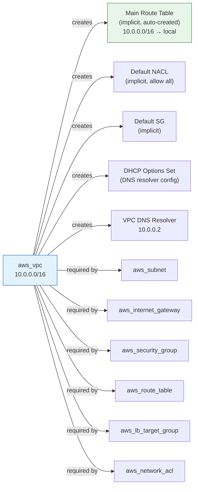

**Primitives created automatically by AWS (not in Terraform):**
- Main route table with `10.0.0.0/16 → local`
- Default NACL (allow all)
- Default security group
- DHCP options set
- DNS resolver at `vpc_cidr_base + 2`

---

### 2. `aws_subnet` — AZ-pinned IP slice

Carves the VPC's CIDR into smaller blocks, each pinned to one AZ.

```hcl
resource "aws_subnet" "public" {
  vpc_id            = aws_vpc.main.id                              # ← belongs to VPC
  cidr_block        = "10.0.1.0/24"                                # ← 251 usable IPs
  availability_zone = data.aws_availability_zones.available.names[0] # ← pinned to 1 AZ
}
```

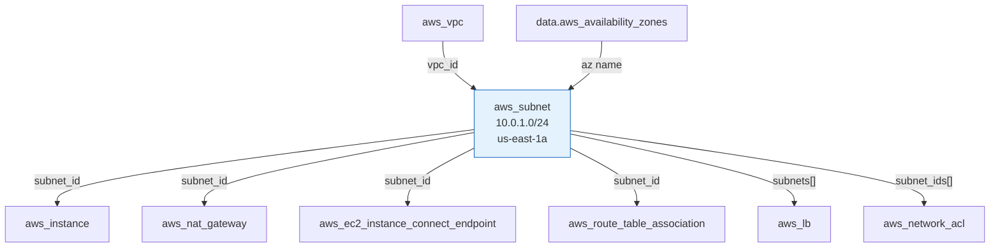

**AWS reserves 5 IPs per subnet:** `.0` (network), `.1` (router), `.2` (DNS), `.3` (future), `.255` (broadcast)

**`cidrsubnet()` helper:**
```
cidrsubnet("10.0.0.0/16", 8, 1)  → "10.0.1.0/24"    # public-1
cidrsubnet("10.0.0.0/16", 8, 2)  → "10.0.2.0/24"    # public-2
cidrsubnet("10.0.0.0/16", 8, 10) → "10.0.10.0/24"   # private-1
cidrsubnet("10.0.0.0/16", 8, 11) → "10.0.11.0/24"   # private-2
```

---

### 3. `aws_internet_gateway` — VPC's door to the internet

One per VPC. Does nothing until a route table points to it.

```hcl
resource "aws_internet_gateway" "main" {
  vpc_id = aws_vpc.main.id     # ← attached to VPC
}
```

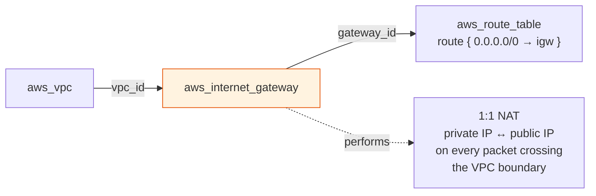

**What it does at runtime:**
- Outbound: rewrites `src 10.0.1.77` → `src 44.195.62.23` (public IP)
- Inbound: rewrites `dst 44.195.62.23` → `dst 10.0.1.77` (private IP)
- Without a route pointing to it: sits idle, does nothing

---

### 4. `aws_eip` + `aws_nat_gateway` — One-way valve

NAT GW needs an EIP (stable public address) and must live in a public subnet.

```hcl
resource "aws_eip" "nat" {
  domain = "vpc"               # ← allocate in VPC scope
}

resource "aws_nat_gateway" "main" {
  allocation_id = aws_eip.nat.id      # ← the public IP to NAT through
  subnet_id     = aws_subnet.public.id # ← MUST be in public subnet (needs IGW route)
  depends_on    = [aws_internet_gateway.main]
}
```

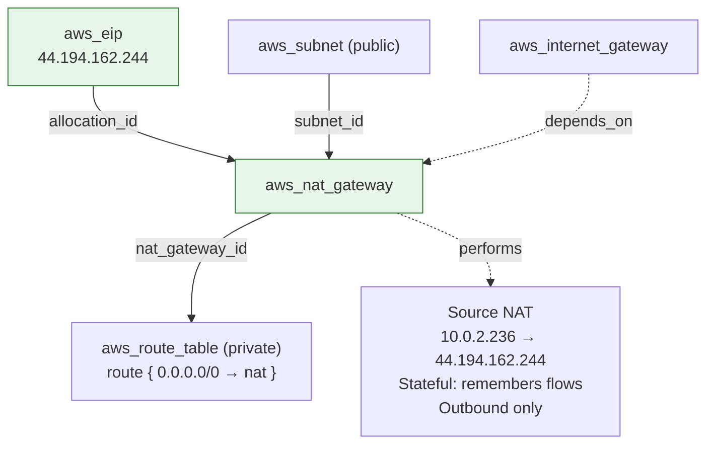

**Why `depends_on`?** The NAT GW needs the IGW to exist first (it routes through it). Terraform can't infer this because there's no direct attribute reference.

**Cost:** $0.045/hr ($32/mo) + $0.045/GB processed. Always destroy after labs.

---

### 5. `aws_route_table` + `aws_route_table_association` — The decision engine

Route tables tell the VPC router where to send packets. Associations bind a subnet to a route table.

```hcl
resource "aws_route_table" "public" {
  vpc_id = aws_vpc.main.id

  route {
    cidr_block = "0.0.0.0/0"                       # ← match: anything not in VPC
    gateway_id = aws_internet_gateway.main.id       # ← target: send to IGW
  }
}

resource "aws_route_table_association" "public" {
  subnet_id      = aws_subnet.public.id             # ← this subnet
  route_table_id = aws_route_table.public.id         # ← uses this RT
}
```

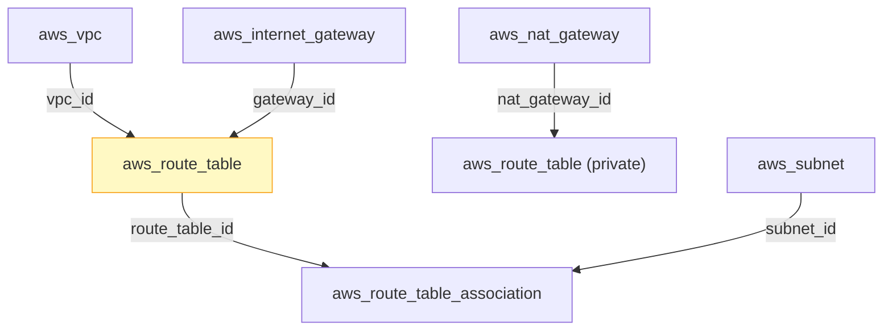

**Implicit rule:** Every route table automatically includes `vpc_cidr → local`. You can't remove it. This is why intra-VPC traffic always works.

**One subnet = one route table.** A subnet without an explicit association uses the VPC's main route table.

---

### 6. `aws_security_group` + rules — Stateful instance firewall

```hcl
resource "aws_security_group" "target" {
  name        = "lab05-target-sg"
  description = "HTTP from ALB, SSH from operator"
  vpc_id      = aws_vpc.main.id        # ← scoped to VPC
}

# CIDR-based rule (allow SSH from a specific IP)
resource "aws_vpc_security_group_ingress_rule" "ssh" {
  security_group_id = aws_security_group.target.id   # ← protect this SG
  cidr_ipv4         = "156.206.107.137/32"            # ← from this IP
  ip_protocol       = "tcp"
  from_port         = 22
  to_port           = 22
}

# SG-to-SG reference (allow HTTP from whoever wears the ALB SG)
resource "aws_vpc_security_group_ingress_rule" "http_from_alb" {
  security_group_id            = aws_security_group.target.id   # ← protect this SG
  referenced_security_group_id = aws_security_group.alb.id      # ← from this SG
  ip_protocol                  = "tcp"
  from_port                    = 80
  to_port                      = 80
}
```

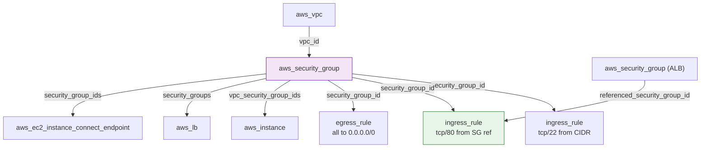

**Two rule reference types:**

| Type | Terraform field | Use case |
|---|---|---|
| CIDR-based | `cidr_ipv4 = "x.x.x.x/32"` | Known static IPs (your laptop) |
| SG-to-SG | `referenced_security_group_id` | Dynamic IPs (ALB nodes, scaling groups) |

**Stateful behavior:** If an ingress rule allows a packet in, the response going out is auto-allowed. No egress rule needed for return traffic.

---

### 7. `aws_network_acl` + `aws_network_acl_rule` — Stateless subnet firewall

```hcl
resource "aws_network_acl" "lab" {
  vpc_id     = aws_vpc.main.id
  subnet_ids = [aws_subnet.main.id]    # ← covers this subnet
}

resource "aws_network_acl_rule" "inbound_all" {
  network_acl_id = aws_network_acl.lab.id
  rule_number    = 100                  # ← order matters! lowest first
  rule_action    = "allow"              # ← can be "allow" or "deny"
  protocol       = "-1"                 # ← all protocols
  cidr_block     = "0.0.0.0/0"
  egress         = false                # ← inbound
}
```

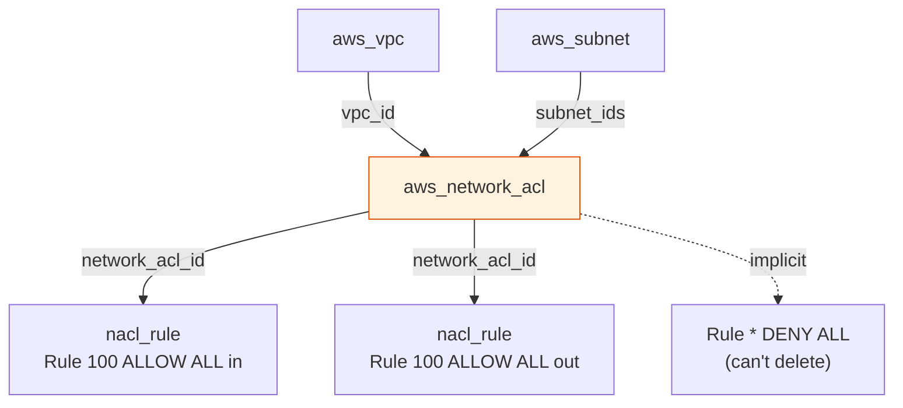

**vs Security Group:**

| | SG | NACL |
|---|---|---|
| Terraform resource | `aws_vpc_security_group_*_rule` | `aws_network_acl_rule` |
| Attaches to | Instance (ENI) | Subnet |
| `rule_action` | N/A (always allow) | `allow` or `deny` |
| `rule_number` | N/A (all evaluated) | Required (order matters) |
| `egress` field | Separate resource types | `true`/`false` on same resource |
| SG-to-SG ref | Yes | No (CIDR only) |

---

### 8. `aws_key_pair` — SSH authentication

```hcl
resource "aws_key_pair" "lab" {
  key_name   = "lab05-key"
  public_key = file("~/.ssh/id_ed25519.pub")   # ← reads local file at plan time
}
```

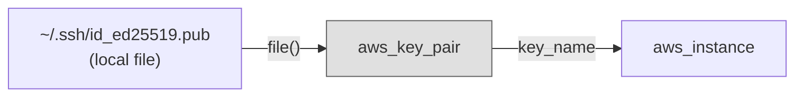

The public key goes to AWS. The private key stays on your laptop. EC2 instances reference the key pair by name.

---

### 9. `aws_instance` — EC2 compute

```hcl
resource "aws_instance" "target" {
  ami                         = data.aws_ami.al2023.id               # ← which OS image
  instance_type               = "t3.micro"                           # ← how much CPU/RAM
  subnet_id                   = aws_subnet.private[0].id             # ← which subnet (= which AZ)
  vpc_security_group_ids      = [aws_security_group.target.id]       # ← which firewall rules
  key_name                    = aws_key_pair.lab.key_name            # ← which SSH key
  associate_public_ip_address = true                                 # ← request public IP (optional)
  user_data                   = <<-EOF                               # ← bootstrap script (runs once)
    #!/bin/bash
    yum install -y nginx && systemctl start nginx
  EOF
}
```

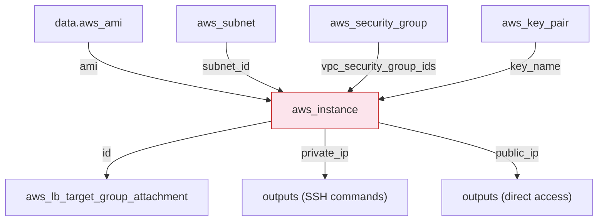

**What `associate_public_ip_address` does:** Asks AWS to assign a public IP from their pool. The EC2 never sees this IP (only private IP on the ENI). The IGW performs the NAT.

**What `user_data` does:** Runs once at first boot. Used in Lab 5 to install nginx and write the HTML page identifying each target.

---

### 10. `aws_lb` + `aws_lb_target_group` + `aws_lb_listener` — Load balancer

Three resources work together:

```hcl
# The load balancer itself (lives in public subnets)
resource "aws_lb" "main" {
  name               = "lab05-alb"
  internal           = false                          # ← internet-facing
  load_balancer_type = "application"                  # ← HTTP/HTTPS (not TCP)
  security_groups    = [aws_security_group.alb.id]    # ← ALB has its own SG
  subnets            = aws_subnet.public[*].id        # ← must span 2+ AZs
}

# Pool of targets with health check config
resource "aws_lb_target_group" "nginx" {
  name     = "lab05-targets"
  port     = 80
  protocol = "HTTP"
  vpc_id   = aws_vpc.main.id

  health_check {
    path     = "/"
    interval = 10                    # ← check every 10s
    matcher  = "200"                 # ← expect HTTP 200
    unhealthy_threshold = 2          # ← 2 failures = unhealthy
  }
}

# Listener: "when traffic hits port 80, forward to target group"
resource "aws_lb_listener" "http" {
  load_balancer_arn = aws_lb.main.arn
  port              = 80
  protocol          = "HTTP"

  default_action {
    type             = "forward"
    target_group_arn = aws_lb_target_group.nginx.arn
  }
}

# Register each EC2 as a target
resource "aws_lb_target_group_attachment" "targets" {
  count            = 2
  target_group_arn = aws_lb_target_group.nginx.arn
  target_id        = aws_instance.target[count.index].id
  port             = 80
}
```

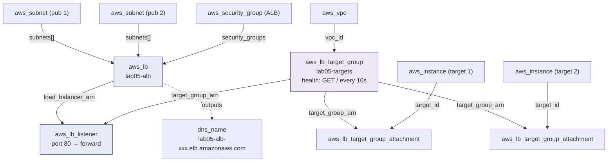

**Three-part relationship:**
- **ALB** = the fleet of nodes accepting traffic
- **Listener** = "on port 80, do this action" (the routing rule)
- **Target Group** = "here are the backends + how to health-check them"

---

### 11. `aws_ec2_instance_connect_endpoint` — Control-plane SSH (Lab 1)

```hcl
resource "aws_ec2_instance_connect_endpoint" "main" {
  subnet_id          = aws_subnet.a.id
  security_group_ids = [aws_security_group.eice.id]
}
```

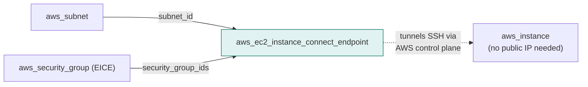

Used in Lab 1 where there was no IGW. Replaced by direct SSH (Lab 2+) and jump host (Lab 3+) once public subnets existed.

---

### 12. Data Sources — Read-only lookups

```hcl
# Available AZs in the region
data "aws_availability_zones" "available" {
  state = "available"
}

# Latest Amazon Linux 2023 AMI
data "aws_ami" "al2023" {
  most_recent = true
  owners      = ["amazon"]
  filter {
    name   = "name"
    values = ["al2023-ami-2023.*-x86_64"]
  }
}

# Your current public IP
data "http" "my_ip" {
  url = "https://checkip.amazonaws.com"
}
```

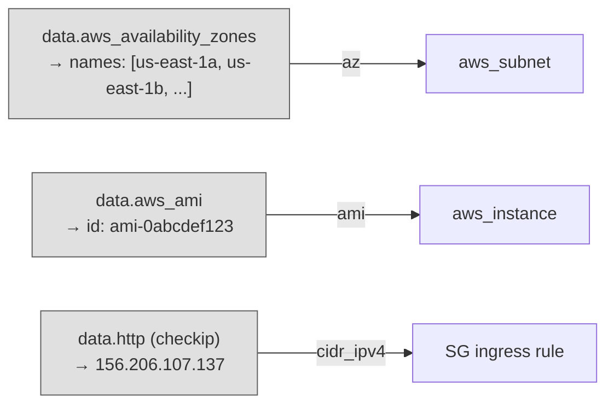

Data sources **read** from AWS (or HTTP), they don't create anything. Used at plan/apply time to get dynamic values.

---

## Resource Count Per Lab

| Resource | Lab 1 | Lab 2 | Lab 3 | Lab 4 | Lab 5 |
|---|---|---|---|---|---|
| `aws_vpc` | 1 | 1 | 1 | 1 | 1 |
| `aws_subnet` | 2 | 2 | 2 | 1 | 4 |
| `aws_internet_gateway` | - | 1 | 1 | 1 | 1 |
| `aws_eip` | - | - | 1 | - | 1 |
| `aws_nat_gateway` | - | - | 1 | - | 1 |
| `aws_route_table` | - | 1 | 2 | 1 | 2 |
| `aws_route_table_association` | - | 1 | 2 | 1 | 4 |
| `aws_security_group` | 2 | 2 | 2 | 1 | 2 |
| SG rules | 4 | 6 | 6 | 3 | 7 |
| `aws_network_acl` | - | - | - | 1 | - |
| `aws_network_acl_rule` | - | - | - | 2 | - |
| `aws_key_pair` | - | 1 | 1 | 1 | 1 |
| `aws_instance` | 2 | 2 | 2 | 1 | 3 |
| `aws_ec2_instance_connect_endpoint` | 1 | - | - | - | - |
| `aws_lb` | - | - | - | - | 1 |
| `aws_lb_target_group` | - | - | - | - | 1 |
| `aws_lb_listener` | - | - | - | - | 1 |
| `aws_lb_target_group_attachment` | - | - | - | - | 2 |
| **Total** | **12** | **17** | **21** | **13** | **32** |

---

## Terraform Patterns Used

### `count` — Create N copies of a resource
```hcl
resource "aws_subnet" "public" {
  count  = 2
  # Reference: aws_subnet.public[0], aws_subnet.public[1]
  # All IDs: aws_subnet.public[*].id
}
```

### `cidrsubnet()` — Calculate subnet CIDRs dynamically
```hcl
cidr_block = cidrsubnet(var.vpc_cidr, 8, count.index + 1)
# cidrsubnet("10.0.0.0/16", 8, 1) → "10.0.1.0/24"
# cidrsubnet("10.0.0.0/16", 8, 2) → "10.0.2.0/24"
```

### `file()` — Read local file at plan time
```hcl
public_key = file("~/.ssh/id_ed25519.pub")
```

### `data.http` — Fetch a URL at plan time
```hcl
data "http" "my_ip" { url = "https://checkip.amazonaws.com" }
locals { my_ip = "${trimspace(data.http.my_ip.response_body)}/32" }
```

### `depends_on` — Explicit ordering when Terraform can't infer it
```hcl
resource "aws_nat_gateway" "main" {
  depends_on = [aws_internet_gateway.main]  # NAT needs IGW to exist first
}
```
