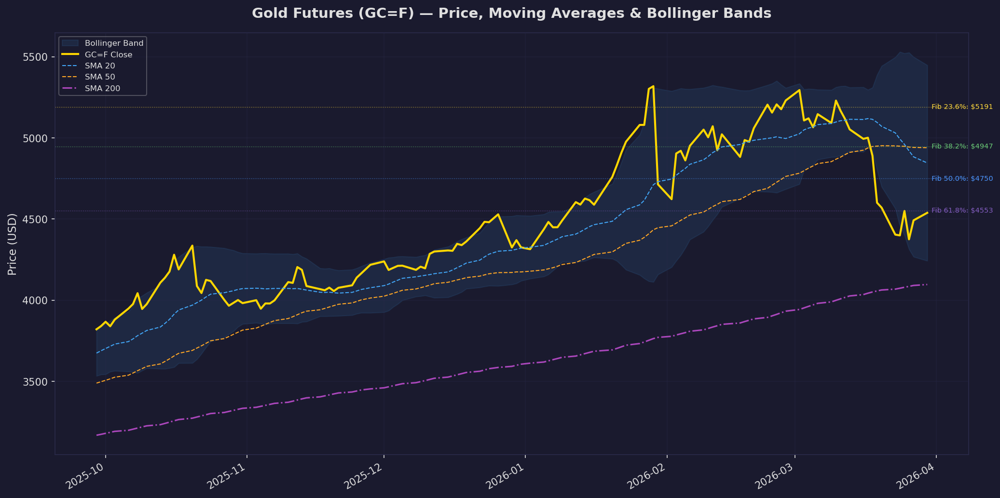
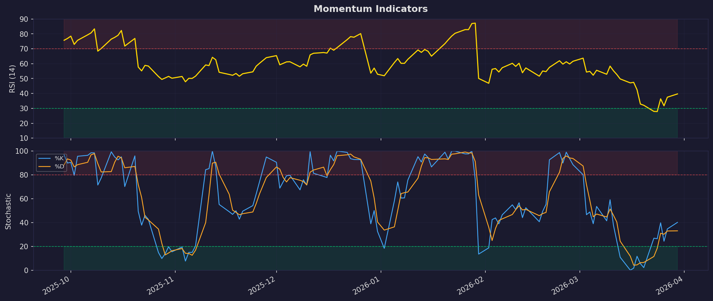
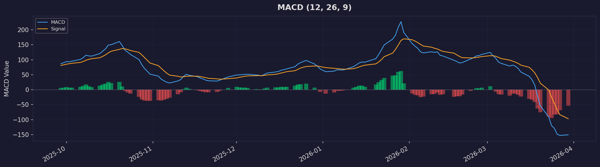
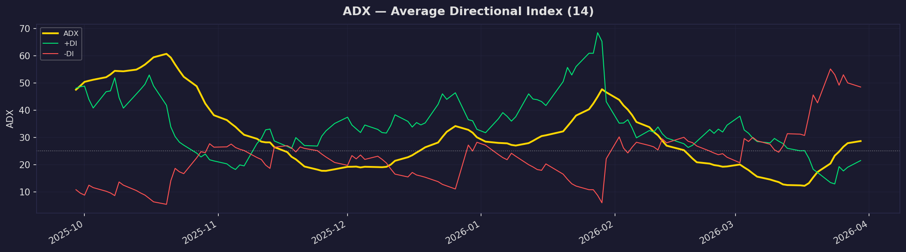
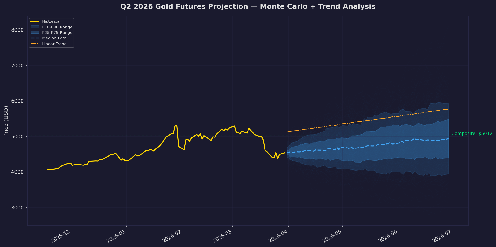

# Gold Futures (GC=F) — Technical Analysis & Q2 2026 Projection

**Date:** March 31, 2026
**Instrument:** COMEX Gold Futures (GC=F)
**Last Close:** $4,538.60
**Analysis Period:** Apr 2024 – Mar 2026 (503 trading days)

---

## 1. Executive Summary

Gold futures are currently trading at $4,538.60, having pulled back sharply from the January 2026 all-time high of $5,586.20 — a correction of approximately 18.7%. Despite this decline, the broader trend remains structurally bullish: price sits well above the 200-day SMA ($4,096.85), which continues to slope upward. However, short-term momentum is decidedly bearish with MACD deep in negative territory, RSI in the lower-neutral zone (39.69), and the -DI dominating +DI on the ADX.

The composite Q2 2026 projection, blending four independent methods, yields a **base-case target of ~$5,012** (+10.4%), with a bear case of $3,887 (-14.3%) and a bull case of $6,181 (+36.2%).

---

## 2. Price Action & Moving Averages

| Indicator | Value | Signal |
|-----------|-------|--------|
| Close | $4,538.60 | — |
| SMA 20 | $4,845.56 | Price **below** — short-term bearish |
| SMA 50 | $4,939.47 | Price **below** — medium-term bearish |
| SMA 200 | $4,096.85 | Price **above** — long-term bullish |
| EMA 12 | $4,636.58 | Price below — near-term weakness |
| EMA 26 | $4,787.36 | Price below — intermediate weakness |

**Interpretation:** A classic "pullback within an uptrend" setup. Price has broken below both the 20- and 50-day SMAs, signaling a meaningful correction phase, but remains ~$440 above the 200-day SMA which acts as the major trend anchor. The EMA 12 / EMA 26 crossover is bearish (EMA-12 < EMA-26), confirming the current down-leg.

**Bollinger Bands:** The bands have widened dramatically (upper: $5,448; lower: $4,243), reflecting elevated volatility. Price sits at the 25th percentile of the band (%B = 0.25), suggesting the market is leaning toward oversold within the current volatility regime.

---

## 3. Momentum Indicators

| Indicator | Value | Zone |
|-----------|-------|------|
| RSI (14) | 39.69 | Lower-neutral (approaching oversold) |
| Stochastic %K | 40.15 | Neutral |
| Stochastic %D | 33.04 | Neutral-low |

**RSI:** At 39.69, RSI is below the 50 midline but has not yet reached the 30 oversold threshold. This indicates persistent selling pressure without panic-level capitulation. Historically, gold RSI rebounds from the 35–40 zone tend to produce meaningful rallies if supported by volume.

**Stochastic:** %K (40.15) has crossed above %D (33.04), forming a bullish crossover from a low level. This is an early recovery signal, though it requires confirmation from price action (a close above the 20-day SMA would confirm).

---

## 4. MACD

| Component | Value |
|-----------|-------|
| MACD Line | -150.78 |
| Signal Line | -97.02 |
| Histogram | -53.76 |

**Interpretation:** MACD is deeply negative, with the MACD line well below the signal line and the histogram still expanding to the downside. This is the most bearish reading among the indicators and suggests that downward momentum has not yet exhausted itself. A narrowing of the histogram (becoming less negative) would be the first sign of a momentum reversal. Traders should watch for a MACD-signal crossover from below as a potential buy trigger.

---

## 5. Trend Strength — ADX

| Component | Value | Interpretation |
|-----------|-------|----------------|
| ADX | 28.62 | Moderate trend strength |
| +DI | 21.46 | Bullish pressure (weak) |
| -DI | 48.48 | Bearish pressure (strong) |

**Interpretation:** ADX at 28.62 confirms a trending market (above the 25 threshold). The -DI massively dominates +DI (48.48 vs. 21.46), leaving no ambiguity: the prevailing trend is bearish. However, extreme -DI readings like this often precede trend exhaustion. A +DI/-DI convergence would signal the correction is fading.

---

## 6. Fibonacci Retracement

Using the 120-day swing range (high: $5,586.20 on Jan 29 → low: $3,913.70 on Oct 30):

| Level | Price | Status |
|-------|-------|--------|
| 0.0% (Swing High) | $5,586.20 | — |
| 23.6% | $5,191.49 | Resistance |
| 38.2% | $4,947.31 | Resistance |
| 50.0% | $4,749.95 | Resistance |
| 61.8% | $4,552.60 | **Current support zone** |
| 100.0% (Swing Low) | $3,913.70 | Major support |

**Interpretation:** Gold is currently hovering right at the 61.8% Fibonacci retracement ($4,552.60), one of the most significant technical levels. Holding above this level would be a strong bullish signal consistent with a "golden ratio" retracement. A breakdown below $4,553 opens the path toward the swing low at $3,914.

---

## 7. Volatility & Volume

| Metric | Value |
|--------|-------|
| ATR (14) | $142.39 |
| 30-day Annualized Volatility | 35.29% |
| 90-day Annualized Volatility | 35.36% |
| 30-day Performance | -7.05% |
| 90-day Performance | +11.75% |

Volatility is elevated at ~35% annualized, consistent with the sharp correction from all-time highs. The ATR of $142 means daily swings of over $140 are normal in the current regime — traders should size positions accordingly.

---

## 8. Q2 2026 Projection (April – June)

Four independent projection methods were used and combined into a weighted composite:

### Method Breakdown

| Method | Weight | End-Q2 Target | Rationale |
|--------|--------|---------------|-----------|
| Linear Regression (6m) | 25% | $5,762 | Extrapolates the dominant uptrend (slope: +$10.02/day, R² = 0.72) |
| EMA Momentum | 15% | $4,162 | Projects current negative EMA convergence rate |
| Monte Carlo (10,000 sims) | 40% | $4,897 (median) | Geometric Brownian motion using 90-day μ and σ |
| Mean Reversion (SMA-50) | 20% | $4,939 | Price tends to revert toward 50-day average |

### Composite Projection

| Scenario | Price Target | Change from Current |
|----------|-------------|-------------------|
| **Bear Case (P10)** | $3,887 | -14.3% |
| **Base Case (Composite)** | $5,012 | +10.4% |
| **Bull Case (P90)** | $6,181 | +36.2% |

### Key Levels to Watch in Q2

- **Immediate support:** $4,553 (Fib 61.8%) → $4,243 (BB lower)
- **Major support:** $4,097 (SMA 200) → $3,914 (swing low)
- **Immediate resistance:** $4,750 (Fib 50%) → $4,846 (SMA 20)
- **Major resistance:** $4,947 (Fib 38.2% / SMA 50) → $5,192 (Fib 23.6%)

---

## 9. Technical Outlook Summary

| Factor | Signal | Weight |
|--------|--------|--------|
| Long-term trend (SMA 200) | Bullish | High |
| Short-term trend (SMA 20/50) | Bearish | Medium |
| Momentum (RSI) | Neutral-bearish | Medium |
| Momentum (MACD) | Bearish | High |
| Trend strength (ADX) | Strong downtrend | High |
| Stochastic crossover | Early bullish | Low |
| Fibonacci support | Holding 61.8% | High |
| Bollinger %B | Oversold zone | Medium |
| Volatility | Elevated | Caution |

**Overall Assessment:** Gold is in a **corrective phase within a secular bull market**. The 61.8% Fibonacci level ($4,553) is the critical line in the sand. If this holds, the base case calls for a recovery toward $5,000+ by end of Q2. If it breaks, expect a test of the 200-day SMA (~$4,097). The stochastic crossover and low Bollinger %B offer early signals that a bounce may be forming, but MACD and ADX have not yet confirmed a reversal.

---

## 10. Disclaimer

This analysis is generated algorithmically using historical price data and standard technical indicators. It is provided for informational and educational purposes only and does not constitute financial advice. Technical projections are inherently uncertain — past patterns do not guarantee future results. Always conduct your own due diligence and consult a licensed financial advisor before making investment decisions. Gold futures involve substantial risk of loss.

---

*Generated using OpenBB + yfinance + ta (Python technical analysis library) | Data through March 30, 2026*
